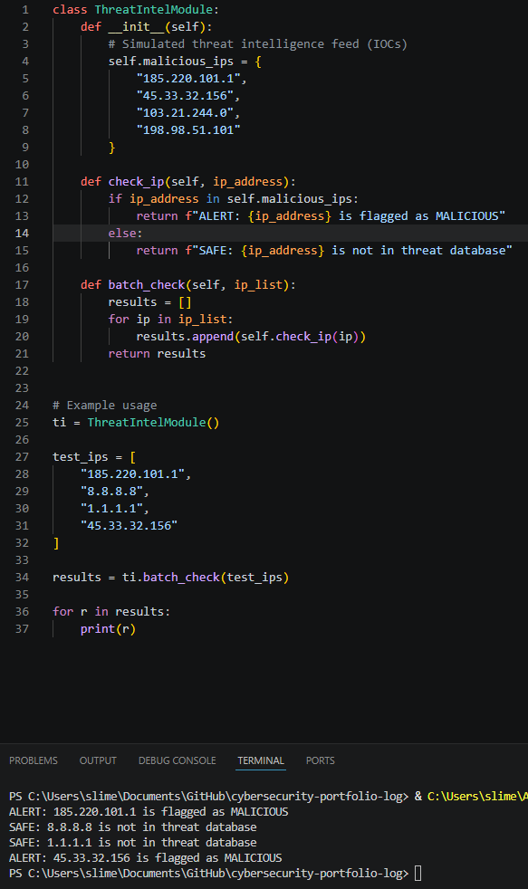

Task: B25 
## Design and Implement a Threat Intelligence Module

### Description
For this task, I designed and implemented a simple Threat Intelligence Module that collects and checks indicators of compromise (IOCs), such as suspicious IP addresses, against a known threat feed.

The purpose of the module is to demonstrate how organisations can use threat intelligence to proactively identify potentially malicious network activity before it causes harm.

### Findings
Strengths
- Simple and easy to understand threat detection logic
- Demonstrates core concept of threat intelligence (IOC matching)
- Can be extended to real feeds (e.g. AbuseIPDB, AlienVault OTX)
- Works in real-time or batch mode
Weaknesses
- Uses static dataset (not real-time threat feed)
- No API integration (manual data only)
- Limited to IP-based detection only
- No scoring or confidence levels

### Evidence

**Script used:** `threat_intel_module.py` 

**Script + output**

### Reflection
This task helped me understand how threat intelligence is used in real cybersecurity environments to proactively identify malicious activity. By implementing a simple IOC-based system, I learned how organisations compare network traffic against known threat databases to detect suspicious behaviour early. It also highlighted how real-world systems are more complex, often using live feeds, scoring systems, and multiple types of indicators such as domains, hashes, and URLs rather than just IP addresses.