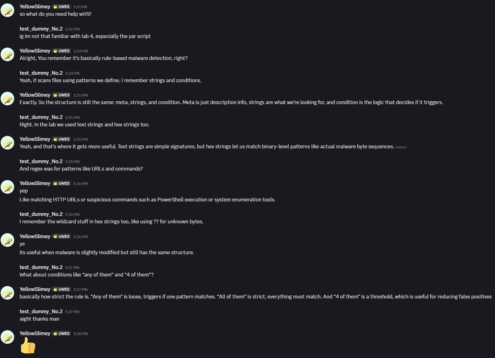

Task: B26  
## Help Another Student Understand a Cybersecurity Concept

### Description

For this task, I `Discord Name: YellowSlimey` assisted my classmate `Student ID: 24800979, Discord Name:test_Dummy_No.2` who was revising Lab 4 content, specifically focusing on YARA scripting and its role in malware detection. They already had some prior understanding of the topic, so the discussion focused on reinforcing key concepts rather than introducing them from scratch.

I helped clarify how YARA rules are structured, including the purpose of the meta, strings, and condition sections, and explained how different string types (text, hex, regex) are used to detect suspicious patterns in files. I also explained how wildcard characters in hex strings can be used to handle variations in malware samples, and how condition logic such as “any of them” and “4 of them” affects rule strictness and false positive rates.

The conversation took place in a casual revision format where they asked targeted questions about areas they were unsure about.

### Evidence

**Chat conversation excerpt:**

### Reflection

This activity helped reinforce my understanding of YARA scripting by requiring me to explain it in a simplified and structured way to another student who already had some prior knowledge. I found that breaking down technical concepts such as rule structure, string matching types, and condition logic into short, clear explanations helped improve my own understanding of how these components work together in practice.

It also highlighted the importance of adapting explanations depending on the learner’s level of knowledge. Since they already had some familiarity with the lab content, the discussion focused more on clarification and refinement rather than full instruction. Overall, this helped strengthen my communication skills in cybersecurity contexts and improved my ability to explain technical topics in a collaborative learning environment.