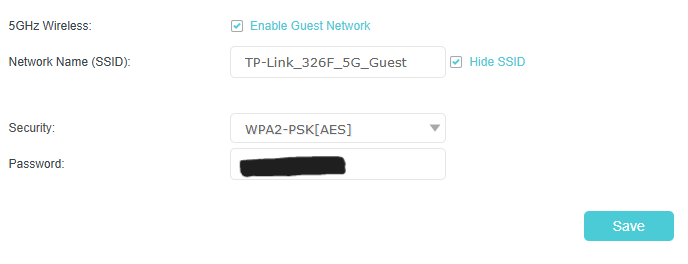
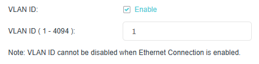

Task: B27
## Apply a Learned Concept to a Real-World Environment

### Description

I applied the cybersecurity concept of network segmentation by creating a VLAN configuration on my home router. I distinguished traffic between my main Wi-Fi network and guest Wi-Fi network using different VLAN IDs. This allowed devices connected to the guest network to remain separated from my primary personal devices and systems.

### Findings

I found that VLANs can improve network security by isolating devices into separate virtual networks while still maintaining internet connectivity. Separating guest devices from the main network reduced unnecessary access between devices and lowered the potential attack surface of the home environment.

### Evidence

### Reflection

This activity helped me understand how enterprise cybersecurity concepts such as network segmentation can also be applied in real-world home environments. As a university student using multiple connected devices, I realised that even simple network isolation methods can significantly improve privacy and security by reducing the risk of unauthorised access between devices.
