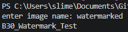
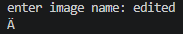

# Task: B30  
## Generate an AI-Created Image, Apply Imperceptible Watermarking, and Test Robustness Through Image-to-Image Regeneration

### Description

This task involved implementing an **imperceptible watermarking system** on an AI-generated image, then testing whether the watermark could survive an **image-to-image regeneration process**. The objective was to evaluate how robust steganographic watermarking is against generative AI transformations, which often alter pixel-level data and can unintentionally destroy hidden information.

The workflow included:
1. Generating an AI image  
2. Embedding a hidden watermark using steganography (LSB-based encoding via Python)  
3. Verifying watermark extraction  
4. Performing AI image-to-image editing  
5. Testing whether the watermark survives post-processing  

### Implementation

#### Step 1 — AI Image Generation
An AI-generated image of a dog with a top hat was created using a text prompt and saved as the base input for watermarking.

**prompt used:**

#### Step 2 — Watermark Embedding (Steganography)

An imperceptible watermark was embedded into the image using Python’s `stepic` library. The watermark is hidden in the pixel data and is not visible to the human eye.

**Code used: `watermark.py`**

#### Step 3 — Watermark Extraction (Verification)
To confirm successful embedding, the watermark was decoded from the image.

**Code used: `decode.py`**

#### Step 4 — Image-to-Image AI Regeneration

The watermarked image was then processed using an AI image-to-image tool to simulate real-world generative transformation (removing the top hat of the dog).

**Input image:**

**prompt used:** refer back to `ai_image_prompt.png`

**Output image:**

#### Step 5 — Post-Transformation Watermark Testing

The regenerated image was tested again to determine whether the hidden watermark survived AI modification.

**Code used: `decode.py`**

**Output image:**

The watermark embedding was successful, and the hidden message could be extracted from the original watermarked image.

**After AI-based image regeneration:**
The watermark was tested again on the modified image
Results showed that the watermark was no longer recoverable 

This demonstrates that steganographic watermarks are vulnerable to generative AI transformations, which often alter underlying pixel data even when visual structure remains similar.

### Reflection
Through this task, I learned how imperceptible watermarking works by hiding information inside image pixel data rather than using visible text or logos. Using Python steganography tools helped me understand how hidden data can be embedded and later extracted from an image. I also learned that modern AI image-to-image editing can damage or completely remove hidden watermarks because generative AI changes the underlying pixel structure of the image. This showed me the limitations of simple LSB-based watermarking and highlighted the importance of more advanced watermarking techniques for protecting digital media in AI environments.