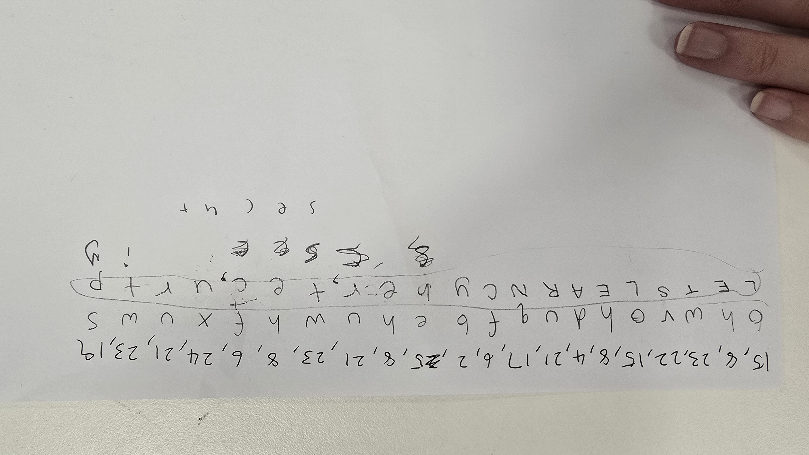
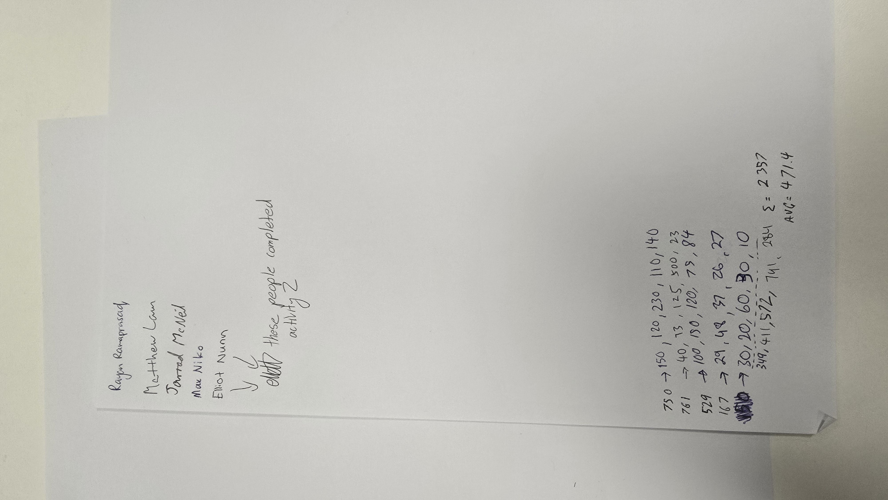
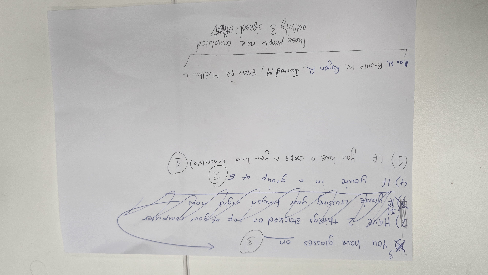

Task: B4
## In-Class Lab Activities (3 Activities)

# Activity 1 — Caesar Cipher Encryption

### Description

In this activity, our group created a secret word and encrypted it using a Caesar cipher. We also observed how another group improved the method by using a Caesar cipher with an increasing shift value to make decryption more difficult.

### Findings

A simple Caesar cipher is easy to implement but also easy to break due to predictable shifting patterns. Increasing the shift value adds slightly more complexity, but the method is still vulnerable to brute-force and pattern-based attacks.

### Reflection

This activity showed me that basic encryption methods can be useful for learning concepts, but they are not secure for real-world cybersecurity use.

# Activity 2 — Private Balance Aggregation Task

### Description
We were instructed to determine the total balance of our group without revealing any individual’s personal balance to others in the group.

### Findings
This task demonstrated the challenge of maintaining privacy while still allowing useful group-level computation. It showed how information can be shared in a controlled way without exposing sensitive individual data.

### Reflection
This activity helped me understand the importance of privacy-preserving techniques in cybersecurity, especially in scenarios involving sensitive personal information.

# Activity 3 — Group-Specific Condition Identification

### Description
We were asked to write down three conditions specific to our group that would not apply to anyone else in the class.

### Findings
Even within similar environments, small differences in group characteristics can create unique identifiers. However, overly specific conditions can risk reducing anonymity if not carefully designed.

### Reflection
This activity made me aware of how easily individuals or groups can potentially be identified based on combined attributes, highlighting the importance of careful data handling and privacy protection in cybersecurity contexts.

### Evidence

# Activity 1: 

# Activity 2:

# Activity 3:
