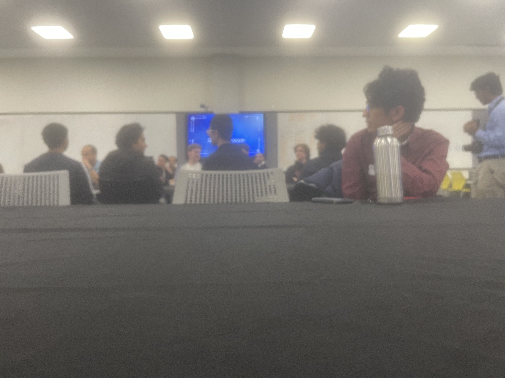

Task: B7 
## Participate in a CS/cybersecurity club activity

### Description
Attended the flagship industry networking and panel event hosted on-campus by the Curtin Cyber Security Club (CCSC) at the Curtin Medical School building (410.101). The event ran from 5:00 PM to 9:00 PM and focused on bridging the gap between student academic paths and the Western Australian professional cybersecurity landscape. The night featured keynote segments and panel discussions with representatives from top tier industry firms including CyberCX, Huntress, MaltIQ, McGrathNicol, and Ever Nimble.

### Findings
- The Shift to Resilience Over Prevention: A common theme among the speakers (especially from Huntress and CyberCX) was that modern cyber security is moving away from pretending breaches can be 100% prevented. Industry focus is heavily on Managed Detection and Response (MDR) and cyber resilience—minimizing the blast radius and recovering quickly when an incident occurs.

- The Threat of Compromised Business Email: Industry panels emphasized that identity-based attacks and Business Email Compromise (BEC) remain the highest-volume threats for local WA enterprises. Attackers are bypassing MFA using sophisticated adversary-in-the-middle phishing kits rather than relying on complex software exploits.

- Valued Non-Technical Skills: Recruiters and team leads from professional services firms like McGrathNicol stressed that while technical baseline knowledge (such as understanding networks and basic digital forensics) gets you an interview, communication skills and the ability to explain complex vulnerabilities to non-technical business clients are what secure the job.

### Evidence

### Reflection
Attending Operation Wasp was a great reality check on how cybersecurity functions outside the classroom. In university labs, tasks are usually cleanly defined with a clear right or wrong answer, but listening to professionals from CyberCX and MaltIQ talk about messy, real-world incident response parameters made me realize how chaotic a live breach environment can be.

It was particularly motivating to hear what local graduate employers look for. Seeing how much emphasis they place on self-driven learning—like participating in club Capture The Flag (CTF) challenges or building home labs—shows me that my degree is just the foundation. Moving forward, I want to engage more with CCSC's weekly technical walk-ins to build up my practical toolset so that I have concrete projects to talk about with these companies when application season rolls around.
